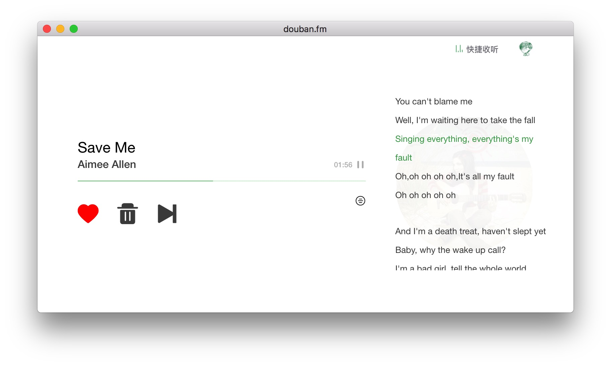

## douban.fm


豆瓣FM桌面应用, 目前正在开发中...


[](http://standardjs.com/)
[](https://david-dm.org/xwartz/douban.fm)
[](https://opensource.org/licenses/MIT)

## 技术栈(based on)


1. 构建跨平台桌面应用: [Electron](http://electron.atom.io/)
2. 构建工具: [Webpack](http://webpack.github.io/docs/),
[Babel](https://babeljs.io), 
[electron-builder](https://github.com/electron-userland/electron-builder)
3. 语言: [ES2015](https://babeljs.io/docs/learn-es2015/), [Sass](http://sass-lang.com/)
4. 框架: [React](https://facebook.github.io/react/), [Redux](https://github.com/reactjs/redux),
[React Router](https://github.com/reactjs/react-router),
[React Hot Loader](https://github.com/gaearon/react-hot-loader),
[Redux Thunk](https://github.com/gaearon/redux-thunk)
5. 代码 lint 工具: [ESLint](http://eslint.org/)

## Release Page
[Releases](https://github.com/xwartz/douban.fm/releases)

## Development

### Install

First, clone the repo via git:

```bash
git clone git@github.com:xwartz/douban.fm.git
```

And then install dependencies.

```bash
$ cd douban.fm && npm i
```

### run

```bash
$ npm run hot-server
$ npm run hot-start
```

or just run dev

```bash
$ npm run dev
```

## Package

```bash
$ npm run compile
$ npm run pack
```

or just run package

```bash
$ npm run package
```

## Build installer App

```bash
$ npm run builder
```

## Note
Before run `package` or `builder`, you should read [electron-builder docs](https://github.com/electron-userland/electron-builder#readme) and checkout [Code Signing](https://github.com/electron-userland/electron-builder#code-signing)


## License
MIT © [xwartz](https://github.com/xwartz)
